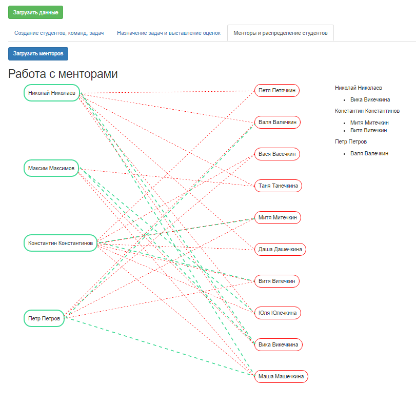

# SHRI.js
Библиотека для распределения студентов ШРИ по командам и менторам

## Демо стенд http://lbelzarl.github.io/SHRI.js/

[](http://lbelzarl.github.io/SHRI.js/)

## Описание

Библиотека SHRI.js предназначена для работы с предметной областью студентов, поступающих в Школу Разработки Интерфейсов Яндекса. В ней реализована работа со студентами, командами, задачами, оценками, менторами, и, самое главное, реализован алгоритм распределение студентов по менторам.

Реализован веб интерфейс на bootstrap + jQuery, в котором реализованы формы для работы с классами.
В нём есть кнопка "Загрузить данные", которая случайным образом сгенерирует данные студентов, распределит их по командам, создаст несколько задач, распределит задачи по студентам и командам, выставит случайным образом несколько оценок.

Во вкладке "Менторы и распределение студентов" с помощью jQuery плагина [$.line](https://github.com/tbem/jquery.line) реализованы линии, показывающие выбор менторов и выбор студентов. В библиотеке реализован метод `assign`, который распределяет студентов по менторам на основе их приоритезированного списка.

Библиотека SHRI.js работает в браузере, создавая объект `window.SHRI` и на сервере в nodejs, подключаемая с помощью `var SHRI = require('./SHRI.js');`.

Реализована сериализация и десериализация структуры данных в JSON формат:
```
node serialize.js
node deserialize.js
```

Структура библиотеки [SHRI.js](https://github.com/lbelzarl/SHRI.js/blob/master/SHRI.js):
* `Students` - класс Студенты
  * `add()` - Позволяет добавить нового студента 
  * `getStudent()` - Позволяет получить студента по его индесу в массиве студентов
  * `getAll()` - Позволяет получить всех студентов
  * `getStudentId` - Позволяет получить индекс студента 
  * `delete()` - Позволяет удалить все стедентов, либо конкретно заданного
  * `assignMentors()` - Каждому студенту случайным образом назначает двух менторов
  * `emptyMentors()` - Удаляет всех менторов у всех студентов
  * `shuffle()` - Случайным образом перемещивает массив студентов

* `Student` - класс Студент
  * `addMentor()` - Добавляет ментора которого выбрал студент
  * `addTask()` - Добавляет студенту задачу
  * `assignMark()` - Выставляет оценку студенту за задачу
  * `getMentors()` - Возвращает всех менторов студента
  * `deleteMentors()` - Удаляет всех менторов студента, либо заданного
  * `serialize()` - Сериализует студента в массив

* `Teams` - класс Команды
  * `find()` - Возвращает команду по ее названию, а при отсутствии null
  * `getTeam()` - Возвращает команду по ее индексу в массиве команд
  * `create()` - Создает новую команду
  * `getTeamId()` - Возвращает индекс команды
  * `getMemberTeam()` - Проверяет находится ли студент уже в какой-нибудь команде
  * `delete()` - Удаляет все команды, либо заданную
  * `getAll()` - Возвращает все команды
  * `shuffle()` - Случайным образом перемешивает массив команд

* `Team` - класс Команда
  * `hasMember()` - Проверяет находится ли студент в команде
  * `addMember()` - Добавляет студента в команду
  * `getAllMember()` - Получает всех студентов команды
  * `serialize()` - Сериализует команду в массив
  * `delMember()` - Удаляет всех студентов из команды, либо заданного
  * `addTask()` - Добавляет задачу команде
  * `assignMark()` - Выставляет оценку команде за задачу

* `Tasks` - класс Задачи
  * `create()` - Создает задачу
  * `get()` - Возвращает задачу
  * `getId()` - Возвращает индекс задачи
  * `getAll()` - Возвращает все задачи
  * `delete()` - Удаляет все задачи, либо заданную

* `Task` - класс Задача
  * `serialize()` - Сериализует задачу в массив

* `Mentors` - класс Менторы
  * `add()` - Добавляет нового ментора
  * `getAll()` - Возвращает всех менторов
  * `getMentor()` - Возвращает заданного ментора
  * `getId()` - Возращает индекс ментора
  * `delete()` - Удаляет всех менторов, либо заданного
  * `assignStudents()` - Каждому ментору случайным образом назначает двух студентов

* `Mentor` - класс Ментор
  * `addStudent()` - Добавляет студента ментору
  * `getStudents()` - Возвращает всех студентов ментора
  * `deleteStudents()` - Удаляет всех студентов у ментора, либо заданного
  * `serialize()` - Сериализует ментора в массив

* `assign` - Распределяет студентов среди менторов в соответствии с приоритизированными списками

* `serialize` - преобразует структуру объектов SHRI.js в json
* `deserialize` - преобразует json в стуктуру объектов SHRI.js